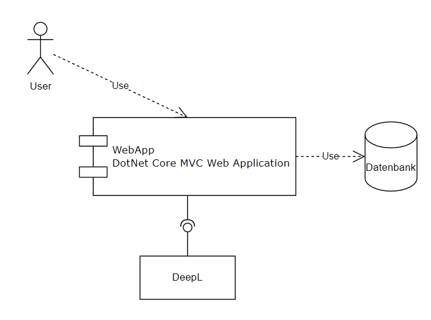

# 

**ARC42 Dokumentation WebApp**

Diese Markdown Datei dient der ARC42 Dokumentation für das SQS-Projekt.

# Einführung und Ziele {#section-introduction-and-goals}

Dieses Dokument beschreibt die Architektur der .NET Core MVC-Anwendung, die als Übersetzer fungiert und die DEEPL-API nutzt. Zusätzlich speichert die Anwendung alle Übersetzungen in einer Datenbank. Dieses Projekt wurde im Rahmen einer Vorlesung an der Hochschule erstellt und wird von meinem Dozenten bewertet.

## Aufgabenstellung {#_aufgabenstellung}

Aufgabe it es eine Anwendung zu erstellen. Die Qualität der Software soll professionell abgesichert werden. Die wesentlichsten vorgegebenen Bedingungen für die Umsetzung sind:
- das Verwenden einer externen API
- das Einbinden einer Datenbank
- das Integrieren einer Benutzeroberfläche
 
## Qualitätsziele {#_qualit_tsziele}

Die folgend aufgeführten Qualitätsziele nach ISO 25010 sind: Functional Suitability, Operability, Maintainability

## Stakeholder {#_stakeholder}

+-----------------+-----------------+-----------------------------------+
| Rolle           | Kontakt         | Erwartungshaltung                 |
+=================+=================+===================================+
| *Student *    | *simon.goettsberge@stud.th-rosenheim.de*  | *Eigener Lernerfolg*|
+-----------------+-----------------+-----------------------------------+
| *Dozent*    | *mario-leander.reimer@th-rosenheim.de*  | *Umsetzung einer fundierten und professionellen Software-Qualitätssicherung* |
+-----------------+-----------------+-----------------------------------+

# Randbedingungen {#section-architecture-constraints}
Die Randbedingungen dieses Projektes werden ausschließlich durch die mündlich kommunizierten Anforderungen bestimmt. Dabei gilt es eine Software zu entwerfen die gezielt entworfen wird. Dabei muss die Software eine externe API, als auch eine Datenbank verwenden. Weitere Details sind alleine dem Studenten überlassen, solange die Software, nach Einschätzung des Dozenten, angemessenen Aufwand qualitätssichernde Maßnahmen genutzt werden. 

# Kontextabgrenzung {#section-system-scope-and-context}

Der User kann in der Applikation Übersetzungen durchführen. Dazu stehen ihm alle Sprachen zur Verfügung die auch DeepL anbietet. Alle durchgeführten Übersetzungen werden in der Datenbank gespeichert. Die gespeicherten Übersetzungen können eingesehen werden. Dabei zeigt sich Ausgangs- und Übersetzungssprache also auch der Original- und Übersetzungstext. Zusätzlich wird auch angezeigt wann die Übersetzung durchgeführt wurde. 

Um die Übersetzungen durchzuführen wird auf die DeepL Api zurückgegriffen.

Die durchgeführten Übersetzungen werden auf einer relationalen Datenbank gespeichert.

## Fachlicher Kontext {#_fachlicher_kontext}

**\<Diagramm und/oder Tabelle>**

**\<optional: Erläuterung der externen fachlichen Schnittstellen>**

## Technischer Kontext {#_technischer_kontext}

**\<Diagramm oder Tabelle>**

**\<optional: Erläuterung der externen technischen Schnittstellen>**

**\<Mapping fachliche auf technische Schnittstellen>**

# Lösungsstrategie {#section-solution-strategy}

.NET Core MVC ist ein leistungsstarkes, quelloffenes Framework, das eine robuste und skalierbare Plattform für die Webentwicklung bietet. Seine modulare Architektur ermöglicht einfache Wartung und Erweiterung. Ein großer Vorteil von .NET Core ist, dass alles in einer Hand liegt: Die gesamte Anwendung besteht aus einem Projekt und muss nicht aus mehreren Projekten zusammengeführt werden, was die Entwicklung beschleunigt, ohne die Qualität zu beeinträchtigen. Außerdem sorgen die plattformübergreifenden Fähigkeiten von .NET Core dafür, dass unsere Anwendung auf verschiedenen Betriebssystemen laufen kann, was entscheidend ist, um ein breiteres Publikum zu erreichen. Das MVC-Muster (Model-View-Controller) gewährleistet eine saubere Trennung der Anliegen, was die Code-Organisation erleichtert und die Wartbarkeit der Anwendung verbessert.

DeepL wird aufgrund seiner überlegenen Übersetzungsqualität ausgewählt, die für die Bereitstellung genauer und natürlicher Übersetzungen entscheidend ist. Die API-Integration von DeepL ist unkompliziert und gut dokumentiert, was eine nahtlose Einbindung in unser System ermöglicht. Durch die Nutzung von DeepL können wir uns auf die Entwicklung der Anwendungslogik und Benutzeroberfläche konzentrieren, anstatt eine eigene Übersetzungsengine entwickeln zu müssen.

# Bausteinsicht {#section-building-block-view}

## Whitebox Gesamtsystem {#_whitebox_gesamtsystem}

***\<Übersichtsdiagramm>***

Begründung

:   *\<Erläuternder Text>*

Enthaltene Bausteine

:   *\<Beschreibung der enthaltenen Bausteine (Blackboxen)>*

Wichtige Schnittstellen

:   *\<Beschreibung wichtiger Schnittstellen>*

### \<Name Blackbox 1> {#__name_blackbox_1}

*\<Zweck/Verantwortung>*

*\<Schnittstelle(n)>*

*\<(Optional) Qualitäts-/Leistungsmerkmale>*

*\<(Optional) Ablageort/Datei(en)>*

*\<(Optional) Erfüllte Anforderungen>*

*\<(optional) Offene Punkte/Probleme/Risiken>*

### \<Name Blackbox 2> {#__name_blackbox_2}

*\<Blackbox-Template>*

### \<Name Blackbox n> {#__name_blackbox_n}

*\<Blackbox-Template>*

### \<Name Schnittstelle 1> {#__name_schnittstelle_1}

...

### \<Name Schnittstelle m> {#__name_schnittstelle_m}

## Ebene 2 {#_ebene_2}

### Whitebox *\<Baustein 1>* {#_whitebox_emphasis_baustein_1_emphasis}

*\<Whitebox-Template>*

### Whitebox *\<Baustein 2>* {#_whitebox_emphasis_baustein_2_emphasis}

*\<Whitebox-Template>*

...

### Whitebox *\<Baustein m>* {#_whitebox_emphasis_baustein_m_emphasis}

*\<Whitebox-Template>*

## Ebene 3 {#_ebene_3}

### Whitebox \<\_Baustein x.1\_\> {#_whitebox_baustein_x_1}

*\<Whitebox-Template>*

### Whitebox \<\_Baustein x.2\_\> {#_whitebox_baustein_x_2}

*\<Whitebox-Template>*

### Whitebox \<\_Baustein y.1\_\> {#_whitebox_baustein_y_1}

*\<Whitebox-Template>*

# Laufzeitsicht {#section-runtime-view}

## *\<Bezeichnung Laufzeitszenario 1>* {#__emphasis_bezeichnung_laufzeitszenario_1_emphasis}

-   \<hier Laufzeitdiagramm oder Ablaufbeschreibung einfügen>

-   \<hier Besonderheiten bei dem Zusammenspiel der Bausteine in diesem
    Szenario erläutern>

## *\<Bezeichnung Laufzeitszenario 2>* {#__emphasis_bezeichnung_laufzeitszenario_2_emphasis}

...

## *\<Bezeichnung Laufzeitszenario n>* {#__emphasis_bezeichnung_laufzeitszenario_n_emphasis}

...

# Verteilungssicht {#section-deployment-view}

## Infrastruktur Ebene 1 {#_infrastruktur_ebene_1}

***\<Übersichtsdiagramm>***

Begründung

:   *\<Erläuternder Text>*

Qualitäts- und/oder Leistungsmerkmale

:   *\<Erläuternder Text>*

Zuordnung von Bausteinen zu Infrastruktur

:   *\<Beschreibung der Zuordnung>*

## Infrastruktur Ebene 2 {#_infrastruktur_ebene_2}

### *\<Infrastrukturelement 1>* {#__emphasis_infrastrukturelement_1_emphasis}

*\<Diagramm + Erläuterungen>*

### *\<Infrastrukturelement 2>* {#__emphasis_infrastrukturelement_2_emphasis}

*\<Diagramm + Erläuterungen>*

...

### *\<Infrastrukturelement n>* {#__emphasis_infrastrukturelement_n_emphasis}

*\<Diagramm + Erläuterungen>*

# Querschnittliche Konzepte {#section-concepts}

## *\<Konzept 1>* {#__emphasis_konzept_1_emphasis}

*\<Erklärung>*

## *\<Konzept 2>* {#__emphasis_konzept_2_emphasis}

*\<Erklärung>*

...

## *\<Konzept n>* {#__emphasis_konzept_n_emphasis}

*\<Erklärung>*

# Architekturentscheidungen {#section-design-decisions}

# Qualitätsanforderungen {#section-quality-scenarios}

::: formalpara-title
**Weiterführende Informationen**
:::

Siehe [Qualitätsanforderungen](https://docs.arc42.org/section-10/) in
der online-Dokumentation (auf Englisch!).

## Qualitätsbaum {#_qualit_tsbaum}

## Qualitätsszenarien {#_qualit_tsszenarien}

# Risiken und technische Schulden {#section-technical-risks}

# Glossar {#section-glossary}

+-----------------------+-----------------------------------------------+
| Begriff               | Definition                                    |
+=======================+===============================================+
| *\<Begriff-1>*        | *\<Definition-1>*                             |
+-----------------------+-----------------------------------------------+
| *\<Begriff-2*         | *\<Definition-2>*                             |
+-----------------------+-----------------------------------------------+
